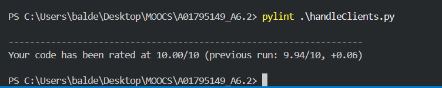

# Reservation system

Primero, para agregar Clientes, tenemos que llamar al programa de la manera 
```
 python .\handleClients.py -m:C .\Files\Customer_create.json
```
De esta manera cliente se añadira y se almacenara en el archivo Customers.json

Luego para editar y eliminar ponemos respectivamente


```
 python .\handleClients.py -m:U .\Files\Customer_update.json
```

```
 python .\handleClients.py -m:D .\Files\Customer_delete.json
```

Y se muestra al final el coverage:


Ejecución de flake y de pylint:



Agregando un Cliente en un Archivo JSON primero, extraemos información, leemos modo de operación y creación nuevo archivo para persistencia de información:


Ahora para añadir Hoteles, mismo comando con diferentes flags en la consola:


